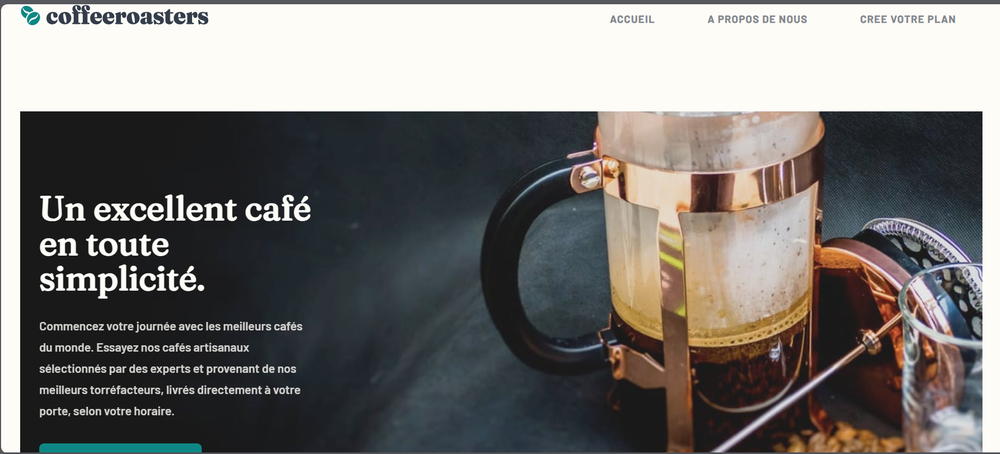

# Frontend Mentor - Coffeeroasters subscription site solution

Ceci est une solution au [Coffeeroasters subscription site challenge on Frontend Mentor](https://www.frontendmentor.io/challenges/coffeeroasters-subscription-site-5Fc26HVY6).

## Table des matières

- [Overview](#overview)
  - [Ce que l'utilisateur peut faire](#utilisateurs)
  - [Capture d'ecran](#Captured'ecran)
  - [Liens](#Liens)
- [Mon Processus](#my-process)
  - [Construit avec](#Construit avec)
 
- [Auteur](#Auteur)

## Aperçu

### Ce que l'utilisateur peut faire

Les utilisateurs sont en mesure de:

- Afficher la disposition optimale pour chaque page en fonction de la taille de l'écran de leur appareil
- Voir les états de survol de tous les éléments interactifs du site
- Faites des sélections pour créer un abonnement au café et consultez un résumé de commande modal de leurs choix (détails fournis ci-dessous)

### Capture d'ecran

### Liens

- Solution URL: [Solution URl](https://github.com/Moulaye-dagnon/coffeeroasters-subscription-site/tree/master)
- Live Site URL: [Add live site URL here](https://coffeeroasters-subscription-site-flax.vercel.app)

## Mon Processus

### Construit avec

- Mobile-first workflow
- [React](https://reactjs.org/) - JS library
- [React Router ](https://reactrouter.com/home) - For SPA
- [Redux ](https://redux-toolkit.js.org/) - State management
- [CSS](https://developer.mozilla.org/fr/docs/Web/CSS) - For styles

## Auteur

- Frontend Mentor - [@Moulaye-dagnon](https://www.frontendmentor.io/profile/Moulaye-dagnon)
- Linkedin - [@moulaye-amadou-dagnon](https://www.linkedin.com/in/moulaye-amadou-dagnon-07a224292/)

